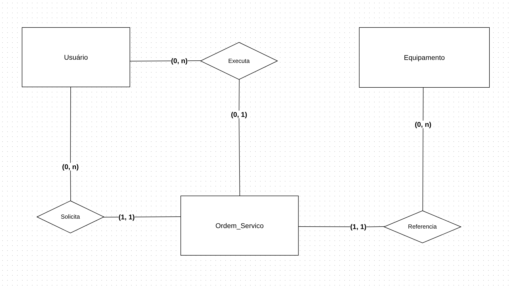

# Resumo de mapeamento — Gestão de Ordens de Serviço

## Diagrama conceitual

---

## Objetivo do modelo

O sistema foi modelado com foco em três entidades principais:

- **Usuário**
- **Equipamento**
- **Ordem_Serviço**

A ideia é representar, de forma simples, quem solicita uma ordem de serviço, qual equipamento está envolvido e qual usuário técnico executa o atendimento.

---

## Entidades do modelo

## 1. Usuário

Representa as pessoas que interagem com o sistema.

### Responsabilidades no domínio

Um usuário pode atuar como:

- **solicitante**
- **técnico**
- futuramente, também pode haver perfil de **supervisor**

### Atributos principais sugeridos

- `id`
- `nome`
- `email`
- `senha_hash`
- `perfil`
- `setor`
- `ativo`

### Observação

Neste modelo simples, todos os papéis ficam concentrados na mesma entidade `Usuário`.  
A diferença entre eles é controlada pelo atributo `perfil`.

---

## 2. Equipamento

Representa o item que será alvo da manutenção ou atendimento.

### Atributos principais sugeridos

- `id`
- `codigo`
- `nome`
- `tipo`
- `localizacao`
- `fabricante`
- `modelo`
- `ativo`

### Observação

Cada equipamento pode aparecer em várias ordens de serviço ao longo do tempo.

---

## 3. Ordem_Serviço

Representa a solicitação de manutenção ou atendimento realizada no sistema.

### Atributos principais sugeridos

- `id`
- `numero`
- `equipamento_id`
- `solicitante_id`
- `tecnico_id`
- `tipo_manutencao`
- `prioridade`
- `status`
- `descricao_falha`
- `descricao_servico`
- `pecas_utilizadas`
- `horas_trabalhadas`
- `abertura_em`
- `inicio_em`
- `conclusao_em`

### Observação

Essa é a entidade central do sistema, pois conecta:

- o **usuário que solicita**
- o **equipamento atendido**
- o **usuário técnico que executa**

---

## Relacionamentos do modelo

## 1. Usuário — Solicita — Ordem_Serviço

### Interpretação

Um usuário pode solicitar várias ordens de serviço, mas cada ordem de serviço é solicitada por um único usuário.

### Cardinalidade

- **Usuário:** `(0,n)`
- **Ordem_Serviço:** `(1,1)`

### Leitura prática

- um usuário pode nunca abrir nenhuma OS
- um usuário pode abrir muitas OS
- toda OS precisa ter exatamente um solicitante

---

## 2. Usuário — Executa — Ordem_Serviço

### Interpretação

Um usuário técnico pode executar várias ordens de serviço, mas cada ordem de serviço pode ter no máximo um técnico responsável.

### Cardinalidade

- **Usuário:** `(0,n)`
- **Ordem_Serviço:** `(0,1)`

### Leitura prática

- um técnico pode não executar nenhuma OS
- um técnico pode executar várias OS
- uma OS pode ser criada sem técnico atribuído inicialmente
- depois, ela pode receber um único técnico

### Observação importante

Esse relacionamento representa o papel de **técnico** dentro da entidade `Usuário`.

---

## 3. Equipamento — Referencia — Ordem_Serviço

### Interpretação

Um equipamento pode estar associado a várias ordens de serviço, mas cada ordem de serviço referencia um único equipamento.

### Cardinalidade

- **Equipamento:** `(0,n)`
- **Ordem_Serviço:** `(1,1)`

### Leitura prática

- um equipamento pode ainda não possuir nenhuma OS
- um equipamento pode ter várias OS ao longo do tempo
- toda OS deve estar vinculada a exatamente um equipamento

---

## Estrutura conceitual final do modelo

Com a simplificação adotada, o projeto fica com esta lógica:

- **Usuário** solicita **Ordem_Serviço**
- **Usuário** executa **Ordem_Serviço**
- **Equipamento** é referenciado por **Ordem_Serviço**

A entidade **Ordem_Serviço** é o centro do domínio.

---

## Chaves e ligações esperadas

### Chaves primárias
- `Usuario.id`
- `Equipamento.id`
- `Ordem_Serviço.id`

### Chaves estrangeiras em Ordem_Serviço
- `solicitante_id -> Usuario.id`
- `tecnico_id -> Usuario.id`
- `equipamento_id -> Equipamento.id`

---

## Regras implícitas do modelo

Mesmo sem incluir `Historico`, o mapeamento já sugere algumas regras importantes:

### Sobre solicitante

- toda ordem de serviço deve possuir um solicitante

### Sobre técnico

- o técnico pode ser nulo no momento da abertura
- depois a OS pode ser atribuída a um técnico

### Sobre equipamento

- toda ordem de serviço deve estar associada a um equipamento

### Sobre perfis de usuário

- o mesmo usuário pertence à entidade `Usuário`
- o papel dele no sistema depende do atributo `perfil`

---

## Decisões de simplificação adotadas

Para manter o projeto didático, **não iremos trabalhar agora com**:

- entidade `Historico`
- auditoria de alterações
- herança formal entre tipos de usuário
- entidades auxiliares para status, prioridade ou tipo de manutenção
- controle de estoque de peças

Esses pontos podem ser adicionados futuramente, quando o projeto evoluir.

---

## Resumo final das cardinalidades

- **Usuário — Solicita — Ordem_Serviço** = `(0,n) : (1,1)`
- **Usuário — Executa — Ordem_Serviço** = `(0,n) : (0,1)`
- **Equipamento — Referencia — Ordem_Serviço** = `(0,n) : (1,1)`

---

## Conclusão

O modelo simplificado fica consistente, fácil de entender e adequado para uma primeira versão do projeto.  
Ele atende bem a proposta didática porque usa apenas as entidades essenciais e mantém a `Ordem_Serviço` como núcleo do sistema.

No futuro, o projeto pode evoluir com novas entidades e regras, mas esta estrutura já é suficiente para representar o fluxo principal do domínio.